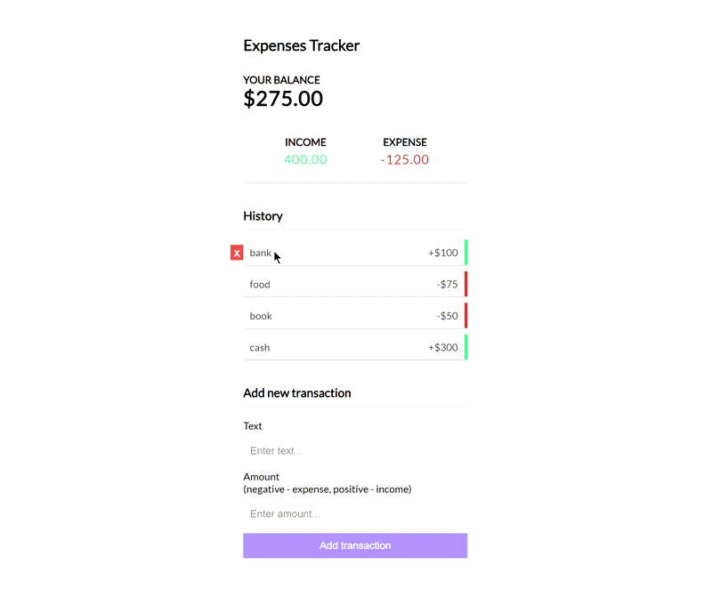
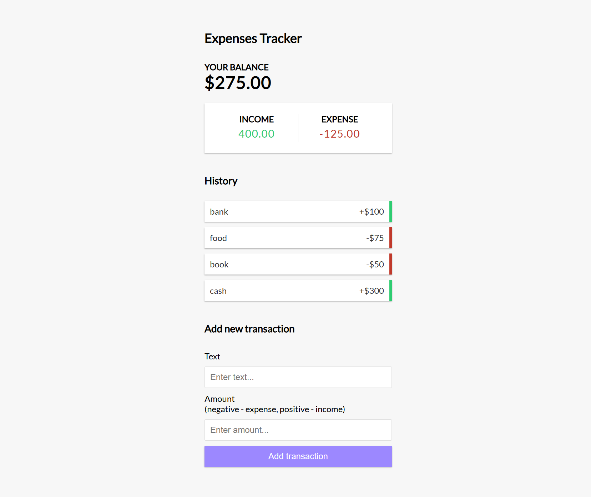

# Expenses Tracker (React + Firebase)

A simple and modern Expenses Tracker app built with React and `react-toastify` for notifications. Users can track income and expenses and get a clear balance overview. Data is stored in `localStorage`.

[Live Demo](https://movie-app-firebase0.netlify.app/)
## Screenshots



---

##  Features

-  Add and delete transactions  
-  Real-time balance and summary  
-  Toast notifications with `react-toastify`  
-  Global state management using React Context API  
-  Data persistence via `localStorage`  
-  Responsive and clean UI  

---

##  Project Structure

```
src/
├── components/
│   ├── AddTransaction.js
│   ├── Balance.js
│   ├── Header.js
│   ├── IncomeExpense.js
│   ├── Transaction.js
│   └── TransactionList.js
│
├── context/
│   └── GlobalContext.js
│
├── helpers/
│   └── ToastNotify.js
│
├── App.css
├── App.js
└── index.js
```

---

##  Technologies Used

- React 19
- React Context API
- React Toastify
- LocalStorage

---

##  Installation

```bash
# 1. Clone the repository
git clone https://github.com/your-username/expenses-tracker-react-firebase.git
cd expenses-tracker-react-firebase

# 2. Install dependencies
npm install

# 3. Run the app
npm start
```

---

## 🛠 Available Scripts

```bash
npm start       # Runs the app in development mode
npm run build   # Builds the app for production
npm test        # Launches the test runner
```

---

##  Firebase Authentication (Coming Soon)

In the next phase of development, Firebase Authentication will be integrated to support:

-  **User registration**
-  **User login/logout**
-  Secure data storage per user

This will enable users to track their expenses across devices securely.

---

##  Notes

- This project uses `localStorage` for storing transaction data.
- You can optionally integrate Firebase for online storage and sync.
- Toast messages are managed with `react-toastify` and can be customized in `helpers/ToastNotify.js`.

---

##  Screenshots



---

##  License

This project is licensed under the MIT License.

---
